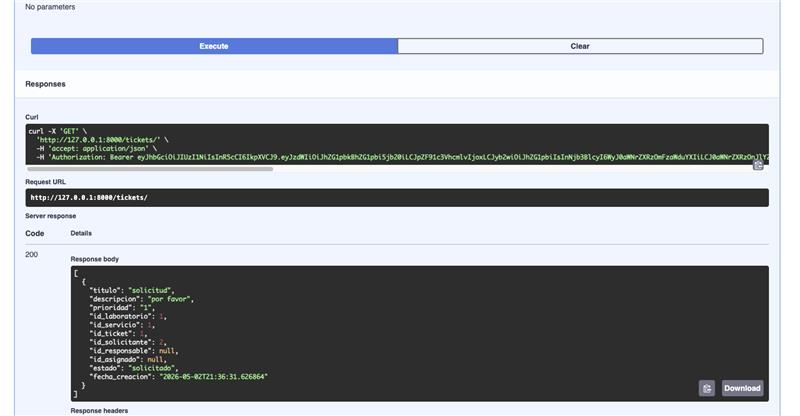
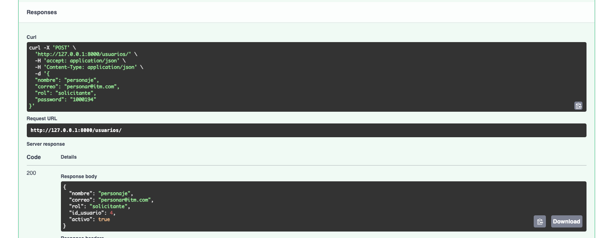
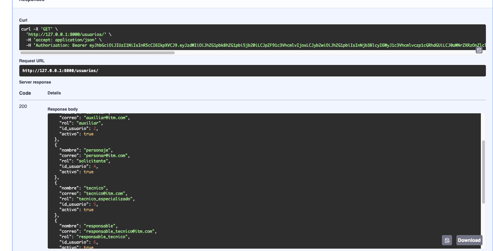
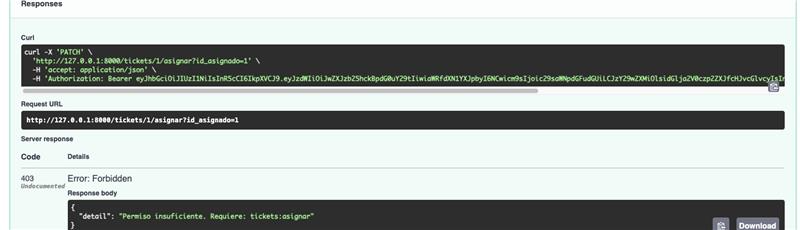
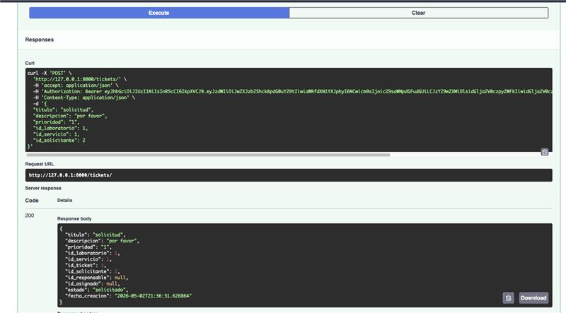
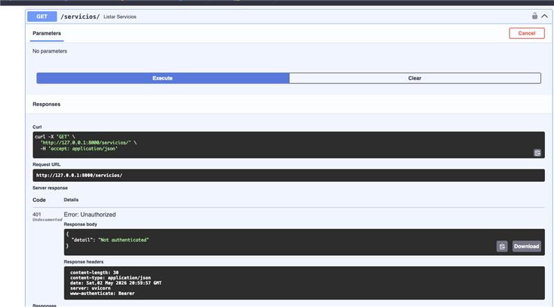

# Sistema de Gestión de Laboratorios - Backend

## Características Principales

## Tecnologías Utilizadas

El proyecto se apoya en un stack tecnológico moderno centrado en la velocidad de desarrollo, la seguridad y la validación de datos.

### Núcleo del Sistema
* **Python (v3.10+)**: Lenguaje de programación base del ecosistema.
* **FastAPI (v0.135.1)**: Framework web de alto rendimiento para la construcción de la API, basado en estándares OpenAPI.
* **SQLAlchemy (v2.0.48)**: Toolkit SQL y mapeador objeto-relacional (ORM) para la gestión de la persistencia de datos.
* **Uvicorn (v0.41.0)**: Servidor ASGI de alta velocidad utilizado para la ejecución y despliegue de la aplicación.

### Validación y Datos
* **Pydantic (v2.12.5)**: Motor de validación de datos y gestión de configuraciones mediante modelos de datos rigurosos.
* **PostgreSQL / Psycopg2 (v2.9.11)**: Sistema de gestión de bases de datos relacional y adaptador binario para la comunicación con Python.

### Seguridad y Autenticación
* **Python-Jose (v3.5.0)**: Implementación de JOSE (JSON Object Signing and Encryption) para la generación y validación de tokens JWT.
* **Passlib (v1.7.4)** y **Bcrypt (v4.0.1)**: Librerías especializadas en el hashing seguro de contraseñas y gestión de esquemas de cifrado.
* **Cryptography (v47.0.0)**: Soporte de primitivas criptográficas para asegurar la integridad de las comunicaciones y datos.

### Utilidades y Entorno
* **Python-Dotenv (v1.2.2)**: Gestión de variables de entorno para la configuración segura de credenciales mediante archivos `.env`.
* **Python-Multipart (v0.0.22)**: Requerido para el procesamiento de datos de formularios y carga de archivos en peticiones HTTP.
* **Httpx (v0.28.1)**: Cliente HTTP de última generación para realizar peticiones asíncronas entre servicios.

## Integrantes
* **FELIPE ZAPATA ARANGO**
* **SAMUEL OQUENDO QUINTERO**
## Aplicaciones y Servicios Web 
## 02/05/2026

## Pasos para configurar el entorno virtual
* Descargar e instalar una versión Python 3.+
* En otro caso, instalar por medio del archivo requeriments.txt en la raíz del proyecto por medio del comando pip install -r requirements.txt
* Ejecutar el comando python /m venv venv para crear el entorno virtual
* Ejecutar el comando venv\Scripts\activate
* Teniendo las dependencias instaladas, ejecutar uvicorn app.main:app --reload y abrir el navegador de preferencia en http://127.0.0.1:8000/docs

### Documentación de Endpoints:

# Documentación de API: Módulo de Laboratorios

Este módulo gestiona los espacios físicos (laboratorios) donde se prestan los servicios técnicos. Utiliza un control de acceso basado en roles (RBAC) mediante Scopes de OAuth2.

## 📋 Resumen de Permisos

| Acción | Endpoint | Método | Scope Requerido | Nivel de Acceso |
| :--- | :--- | :--- | :--- | :--- |
| **Crear** | `/laboratorios/` | `POST` | `laboratorios:create` | Administrador |
| **Listar** | `/laboratorios/` | `GET` | `laboratorios:read` | Todos los Roles |
| **Consultar** | `/laboratorios/{id}` | `GET` | `laboratorios:read` | Todos los Roles |
| **Eliminar** | `/laboratorios/{id}` | `DELETE` | `laboratorios:delete` | **Solo Administrador** |

---

## Endpoints Detallados

## Laboratorio

### 1. Crear Laboratorio
Permite registrar una nueva sede o laboratorio en el sistema.

*   **URL:** `/laboratorios/`
*   **Método:** `POST`
*   **Cabecera Obligatoria:** `Authorization: Bearer <token>`
*   **Cuerpo (JSON):**
    
```json
    {
      "nombre": "Laboratorio de Inteligencia Artificial",
      "ubicacion": "Bloque M, Oficina 301",
      "descripcion": "Área destinada a investigación y desarrollo de modelos"
    }
    ```
*   **Respuestas:**
    *   **200 OK:** Devuelve el objeto creado con su respectivo `id_laboratorio`.
    *   **403 Forbidden:** El token no cuenta con el scope `laboratorios:create`.

---

### 2. Listar Todos los Laboratorios
Retorna una colección de todos los laboratorios activos en la base de datos.

*   **URL:** `/laboratorios/`
*   **Método:** `GET`
*   **Seguridad:** Requiere scope `laboratorios:read`.
*   **Respuestas:**
    *   **200 OK:**
        ```json
        [
          {
            "id_laboratorio": 1,
            "nombre": "Redes de Datos",
            "ubicacion": "Bloque A",
            "descripcion": "Mantenimiento de infraestructura"
          }
        ]
        ```

---

### 3. Obtener Laboratorio por ID
Recupera la información detallada de un laboratorio específico.

*   **URL:** `/laboratorios/{id_laboratorio}`
*   **Método:** `GET`
*   **Parámetros de Path:** `id_laboratorio` (Integer)
*   **Respuestas:**
    *   **200 OK:** Objeto `LaboratorioOut`.
    *   **404 Not Found:** El ID ingresado no existe.

---

### 4. Eliminar Laboratorio
Acción crítica para dar de baja un laboratorio. Este endpoint está restringido exclusivamente a usuarios con rol de administrador.

*   **URL:** `/laboratorios/{id_laboratorio}`
*   **Método:** `DELETE`
*   **Seguridad:** Requiere scope `laboratorios:delete`.
*   **Respuestas:**
    *   **204 No Content:** Eliminación exitosa (sin cuerpo de respuesta).
    *   **403 Forbidden:** El usuario no tiene el permiso necesario.
    *   **404 Not Found:** El laboratorio ya no existe o el ID es incorrecto.

---

## ⚠️ Errores Comunes

| Código | Mensaje | Causa |
| :--- | :--- | :--- |
| **401** | `Token inválido o expirado` | El token ha caducado o el formato es incorrecto. |
| **403** | `Not enough permissions` | El rol del usuario no tiene el scope asignado en el sistema. |
| **422** | `Unprocessable Entity` | Los datos enviados en el JSON no coinciden con el esquema requerido. |

## Servicio

# Documentación de API: Módulo de Servicios

Este módulo gestiona el catálogo de servicios técnicos disponibles (ej. Mantenimiento, Instalación, Soporte de Software) que pueden ser solicitados mediante tickets.

## 📋 Resumen de Permisos

| Acción | Endpoint | Método | Scope Requerido | Nivel de Acceso |
| :--- | :--- | :--- | :--- | :--- |
| **Crear** | `/servicios/` | `POST` | `servicios:create` | Administrador |
| **Listar** | `/servicios/` | `GET` | `servicios:read` | Todos los Roles |
| **Consultar** | `/servicios/{id}` | `GET` | `servicios:read` | Todos los Roles |
| **Eliminar** | `/servicios/{id}` | `DELETE` | `servicios:delete` | **Solo Administrador** |

---

### 2. Crear Servicio
Registra un nuevo tipo de servicio en el catálogo del sistema.

*   **URL:** `/servicios/`
*   **Método:** `POST`
*   **Cabecera Obligatoria:** `Authorization: Bearer <token>`
*   **Cuerpo (JSON):**
    ```json
    {
      "nombre": "Mantenimiento Preventivo",
      "descripcion": "Limpieza física y optimización de hardware",
      "id_laboratorio": 1
    }
    ```
*   **Respuestas:**
    *   **200 OK:** Devuelve el objeto `ServicioOut` creado.
    *   **403 Forbidden:** El usuario no posee el scope `servicios:create`.

---

### 2. Listar Todos los Servicios
Obtiene la lista completa de servicios configurados para todos los laboratorios.

*   **URL:** `/servicios/`
*   **Método:** `GET`
*   **Seguridad:** Requiere scope `servicios:read`.
*   **Respuestas:**
    *   **200 OK:**
        ```json
        [
          {
            "id_servicio": 1,
            "nombre": "Instalación de Software",
            "descripcion": "Configuración de SO y programas base",
            "id_laboratorio": 2
          }
        ]
        ```

---

### 3. Obtener Servicio por ID
Consulta la información específica de un servicio mediante su identificador.

*   **URL:** `/servicios/{id_servicio}`
*   **Método:** `GET`
*   **Parámetros de Path:** `id_servicio` (Integer)
*   **Respuestas:**
    *   **200 OK:** Objeto detallado del servicio.
    *   **404 Not Found:** El servicio con el ID especificado no existe.

---

### 4. Eliminar Servicio
Remueve un servicio del catálogo. Restringido a usuarios con permisos de administración.

*   **URL:** `/servicios/{id_servicio}`
*   **Método:** `DELETE`
*   **Seguridad:** Requiere scope `servicios:delete`.
*   **Respuestas:**
    *   **204 No Content:** Eliminación exitosa.
    *   **403 Forbidden:** El token no tiene permisos suficientes para borrar registros.
    *   **404 Not Found:** El ID del servicio no fue encontrado en el sistema.

---

## ⚠️ Consideraciones de Integración

> [!NOTE]
> Al eliminar un servicio, asegúrese de que no existan tickets activos vinculados a dicho ID para mantener la integridad referencial de la base de datos (según la configuración de su base de datos, esto podría lanzar un error de restricción de llave foránea).

# Documentación de API: Módulo de Tickets

Este módulo es el núcleo del sistema y permite gestionar el ciclo de vida de los requerimientos de soporte técnico, desde su creación hasta su finalización.

## 📋 Resumen de Permisos y Flujo

| Acción | Endpoint | Método | Scope Requerido | Roles Autorizados |
| :--- | :--- | :--- | :--- | :--- |
| **Crear** | `/tickets/` | `POST` | `tickets:create` | Solicitante, Admin |
| **Listar** | `/tickets/` | `GET` | `tickets:read` | Todos los Roles |
| **Consultar** | `/tickets/{id}` | `GET` | `tickets:read` | Todos los Roles |
| **Actualizar Estado**| `/tickets/{id}/estado`| `PATCH` | `tickets:update` | Admin, Responsable, Técnico, Auxiliar |
| **Eliminar** | `/tickets/{id}` | `DELETE` | `tickets:delete` | **Solo Administrador** |

---

## Ticket

### 1. Crear Ticket
Permite a un solicitante o administrador abrir un nuevo requerimiento de soporte.

*   **URL:** `/tickets/`
*   **Método:** `POST`
*   **Cuerpo (JSON):**
    
```json
    {
      "titulo": "Falla en conexión de red",
      "descripcion": "El equipo no obtiene dirección IP por DHCP",
      "prioridad": "Alta",
      "id_laboratorio": 1,
      "id_servicio": 2,
      "id_solicitante": 5
    }
    ```
*   **Estado Inicial:** El ticket se crea automáticamente con el estado `solicitado`.

---

### 2. Listar Tickets
Retorna la lista de tickets. 
*Nota: Según la lógica de negocio, los solicitantes verán sus propios tickets, mientras que los administradores y técnicos podrán ver todos o los asignados.*

*   **URL:** `/tickets/`
*   **Método:** `GET`
*   **Seguridad:** Requiere scope `tickets:read`.

---

### 3. Actualizar Estado (Gestión de Flujo)
Este endpoint permite cambiar el estado del ticket (ej. de `solicitado` a `en proceso` o `terminado`).

*   **URL:** `/tickets/{id_ticket}/estado`
*   **Método:** `PATCH`
*   **Cuerpo (JSON):**
    ```json
    {
      "estado": "en_proceso",
      "observacion_tecnico": "Se procede a revisar el cableado estructurado",
      "id_asignado": 3
    }
    ```
*   **Estados permitidos:** `solicitado`, `recibido`, `en_proceso`, `en_revision`, `terminado`.

---

### 4. Eliminar Ticket
Elimina físicamente el registro del ticket de la base de datos.

*   **URL:** `/tickets/{id_ticket}`
*   **Método:** `DELETE`
*   **Seguridad:** Requiere scope `tickets:delete` (Restringido a **Admin**).
*   **Respuestas:**
    *   **204 No Content:** Eliminación exitosa.
    *   **404 Not Found:** El ticket no existe.

---

## Estados del Sistema

El campo `estado` dentro de este módulo sigue la siguiente progresión lógica:
1.  **Solicitado:** Creado por el usuario.
2.  **Recibido:** Validado por el Responsable Técnico.
3.  **Asignado:** El técnico está trabajando en la solución.
4.  **En Revisión:** La solución está siendo verificada.
5.  **Terminado:** El servicio ha sido completado con éxito.

---

## ⚠️ Errores Comunes
*   **403 Forbidden:** El usuario intenta actualizar un estado para el cual su rol no tiene permiso (ej. un Solicitante intentando pasar un ticket a `recibido`).
*   **422 Unprocessable Entity:** El valor del campo `estado` no coincide con los valores permitidos en el esquema.


### Evidencias: 

##Admin

# Listar tickets admin


# Crear usuario como admin


# Listar usuarios


#Asignas Ticket como usuario 


#Crear ticket como usuario 


# Listar servicio como solicitante


### Configuración de la Base de Datos
## Conexión manejada por medio de SQLAlchemy
## Schema asignado: jwt_grupo_2